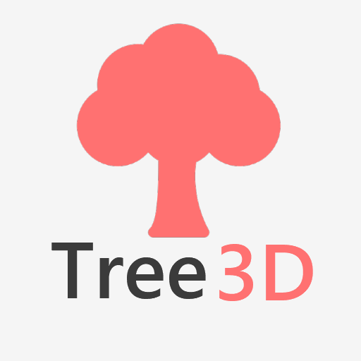
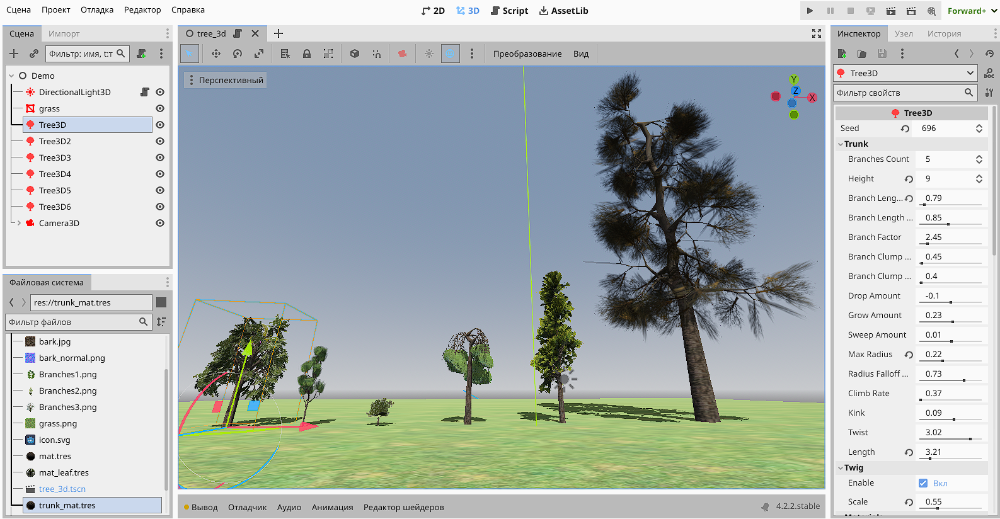

# Tree3D
Plugin for procedural generation of 3D trees of varying complexity.



## Supported Godot Engine Versions
- Godot 4.0
- Godot 4.1
- Godot 4.2
- Godot 4.3



## Notes
- To ensure the tree displays correctly, use Cull Mode: Front for the tree trunk material.
- To change the season, you can make one unique leaf material for all the trees and then change its color or texture to make them yellow.

## Building the GDExtension

1. Place [godot-cpp](https://github.com/godotengine/godot-cpp) of the version you need in the godot-cpp folder
2. Use the SCons command (depending on your platform and Godot build version):
```sh
scons target=template_release platform=windows
```
Or use [ready-made libraries](https://github.com/JekSun97/gdTree3D/releases)

## Using Docker to build this GDExtension

For easier reproducibility, there is a Dockerfile provided for building binaries for Linux and Windows.

```sh
docker build -t tree3dbuilder:latest .
docker run --rm -v "$(pwd):/source" tree3dbuilder:latest scons target=template_release arch=x86_64 platform=windows
```

## Donations
If you liked this plugin, you could send me a thank you via Ko-Fi using [Ko-Fi](https://ko-fi.com/jeksun), I would be very grateful!
Your name and your GitHub account (if you have one) will be listed below :)
(Don't forget to write me an email so I can add you, your name and account)

**List:**
- Meier Lukas

Thank you for your support!
